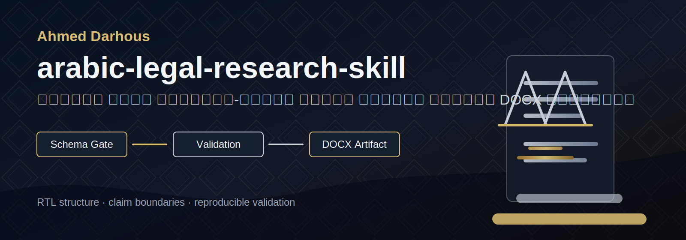
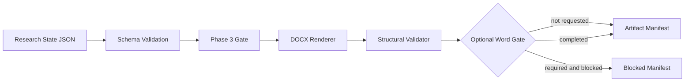

<p align="center">
  
</p>

<p align="center">
  <a href="https://github.com/Darhous/arabic-legal-research-skill/actions/workflows/ci.yml"></a>
  =3.11" src="https://img.shields.io/badge/Python-%3E%3D3.11-2f6f9f">
  
  
  
  
</p>

# arabic-legal-research-skill

منظومة Python وClaude Skill لإدارة تحقق بحث قانوني عربي منظم، مع توليد مسودة DOCX عربية RTL وفحصها بنيويًا كحزمة OOXML. المشروع يركز على قابلية التحقق، حدود الادعاء، وسلامة المسار التنفيذي بدل الاكتفاء بتعليمات نصية عامة.

## لماذا المشروع؟

إنتاج بحث قانوني عربي يحتاج أكثر من صياغة لغوية. يحتاج ترتيبًا منهجيًا، حماية للخطة المعتمدة، ضبطًا للمراجع والحواشي، ومخرجات يمكن اختبارها. هذا المستودع يحول تلك المتطلبات إلى schema، validators، CLI، وتقارير قابلة لإعادة التشغيل.

## القدرات المثبتة

- تحقق JSON Schema لحالة البحث.
- Phase 3 validation gate عبر validators تنفيذية.
- حماية عناوين الخطة المعتمدة وترتيبها.
- فحص الاقتباسات والحواشي والببليوغرافيا وحدود التحقق.
- توليد DOCX عربي RTL من fixture صالح.
- فحص DOCX بنيويًا: parts، relationships، XML، styles، RTL، fields، footnotes، page setup، وموانع المحتوى الخارجي.
- manifest يحتوي hashes وحالة artifact.
- Word worker اختياري مع مهلة زمنية وتنظيف محدود بالملكية المثبتة.
- wheel build وinstalled-wheel smoke من خارج root المستودع.

## الحدود

لا يثبت المشروع صحة الرأي القانوني، ولا يتحقق من أصالة المصادر عبر الإنترنت، ولا يقدم مراجعة بشرية، ولا يقرر صلاحية الإيداع أو الطباعة النهائية. عند تعذر التحقق من مصدر أو سلوك Word، يظل ذلك قيدًا مصرحًا به في التقرير.

## Architecture



## Workflow

1. اقرأ research-state JSON.
2. تحقق من schema.
3. شغل validators الخاصة بالمنهجية، الخطة، الإحالات، الحواشي، والمطالبات.
4. ولّد DOCX بنيويًا.
5. افحص DOCX كحزمة OOXML.
6. شغل Word gate عند الطلب فقط.
7. اكتب artifact manifest.

## المتطلبات

- Python `>=3.11`.
- dependency runtime: `jsonschema>=4.22`.
- Windows وMicrosoft Word وpywin32 مطلوبة فقط عند تشغيل Word gate الحقيقي.
- الاختبارات العادية وCI لا تشغل Word الحقيقي.

## التثبيت

من المصدر المحلي:

```bash
python -m pip install .
```

للتطوير:

```bash
python -m pip install -e ".[dev]"
```

من wheel محلية بعد البناء:

```bash
python -m pip wheel . --no-deps --no-build-isolation --wheel-dir dist
python -m pip install dist/arabic_legal_research_skill-0.3.0-py3-none-any.whl
```

لا توجد مطالبة بنشر PyPI حاليًا.

## Quick Start

```bash
legal-research-skill schema-check examples/fixtures/valid/minimal-valid.json --format json
legal-research-skill validate examples/fixtures/valid/approved-plan-locked.json --format json
legal-research-skill render-docx examples/fixtures/valid/approved-plan-locked.json --output out/draft.docx --format json
legal-research-skill validate-docx out/draft.docx --format json
legal-research-skill build-artifact examples/fixtures/valid/approved-plan-locked.json --output-dir out/artifact --format json
```

## أمثلة CLI

عرض validators:

```bash
legal-research-skill list-validators
```

شرح قاعدة محلية:

```bash
legal-research-skill explain CLAIM-001
```

فحص fixture غير صالح:

```bash
legal-research-skill validate examples/fixtures/invalid/unsupported-output-claim.json --format json
```

## DOCX Generation

أمر `render-docx` ينتج ملف DOCX ويفحصه بنيويًا مباشرة:

```bash
legal-research-skill render-docx examples/fixtures/valid/approved-plan-locked.json --output out/research.docx --format json
```

النتيجة الصالحة تعني أن الحزمة البنيوية سليمة وفق فاحص المشروع، ولا تعني مراجعة Word أو مراجعة بشرية.

## Structural Validation

```bash
legal-research-skill validate-docx out/research.docx --format json
```

الفاحص يرفض العلاقات الخارجية، المسارات غير الآمنة داخل ZIP، أجزاء تنفيذية أو ماكرو، XML غير صالح، وغياب الأجزاء المطلوبة.

## Microsoft Word Gate

Word gate اختياري:

```bash
legal-research-skill finalize-word out/research.docx --output out/research-word.docx --word-timeout-seconds 60 --format json
```

وعند جعله إلزاميًا داخل artifact build:

```bash
legal-research-skill build-artifact examples/fixtures/valid/approved-plan-locked.json --output-dir out/artifact-word --require-word --word-timeout-seconds 60 --format json
```

في بيئة Phase 6 الحالية، pywin32 وWord COM مسجلان، لكن `DispatchEx("Word.Application")` يتوقف حتى انتهاء المهلة. المسار يعود بـ`TIMEOUT`، ينهي worker فقط، ولا يقتل جلسات Word غير مثبتة الملكية، ولا ينتج ملف Word نهائيًا.

## Artifact Manifest

`build-artifact` يكتب:

- DOCX قبل Word gate.
- `artifact-manifest.json`.
- hashes للمدخلات والمخرجات.
- claims مسموحة وممنوعة.
- limitations صريحة.
- Word evidence عند تشغيل gate.

## Result States وExit Codes

الحالات العملية:

- `STRUCTURALLY_VALID`: DOCX البنيوي صالح.
- `BLOCKED`: بوابة مطلوبة لم تمر.
- `TIMEOUT`: Word worker تجاوز المهلة.
- `FAILED`: فشل تنفيذي أو بنيوي.
- `NOT_RUN`: Word gate غير مطلوب.
- `NOT_AVAILABLE`: Word أو pywin32 غير متاحين.

Exit codes:

- `0`: نجاح العملية المطلوبة.
- `1`: فشل تحقق أو artifact.
- `2`: خطأ إدخال أو وسيطات.
- `3`: Word gate إلزامي ومحجوب أو غير متاح.
- `4`: فشل Word غير متوقع بعد طلب gate.

## مثال مخرجات مختصر

```json
{
  "final_artifact_status": "STRUCTURALLY_VALID",
  "allowed_claims": ["DOCX generated", "DOCX structurally validated", "RTL structurally applied"],
  "word_evidence": {"status": "NOT_RUN", "availability": "not_checked"}
}
```

## بنية المستودع

```text
src/legal_research_skill/     Python package and CLI
schemas/                      Canonical JSON schemas
rules/                        Legal research operating rules
validators/                   Reviewer contracts
examples/fixtures/            Valid and invalid research-state fixtures
tests/                        Unit, integration, acceptance, regression tests
reports/                      Machine-readable and phase reports
assets/readme/                GitHub presentation assets
.github/workflows/            CI configuration
```

## الاختبارات والجودة

الأوامر الرسمية:

```bash
python -m compileall src
ruff format --check .
ruff check .
pytest
```

Phase 6 result: `141 passed, 1 skipped`, coverage `95.03%`. حد القبول في `pyproject.toml` هو `95%`.

## الأمان

- لا يستخدم `eval` أو `exec`.
- لا يستخدم shell command composition داخل Python runner.
- لا ينفذ ماكرو داخل DOCX.
- لا يسمح بعلاقات DOCX خارجية.
- لا يقتل عمليات Word العامة.
- لا يكتب أسرارًا في fixtures أو reports.

## Reproducibility

المخرجات البنيوية تعتمد على fixture ثابتة، schema ثابت، وrenderer deterministic. Word output ليس جزءًا من ضمان التكرارية ما دام COM dispatch محجوبًا في هذه البيئة.

## القيود البيئية

- Word gate الحقيقي يتطلب جلسة Windows/Office قابلة للأتمتة.
- في Phase 6، آخر checkpoint مؤكد: `dispatch_started`.
- ownership لعملية Word لم يثبت لأن `app.Hwnd` لم يعد قبل المهلة.
- installed-wheel smoke استخدم dependency محلية مثبتة للنظام لـ`jsonschema` دون تنزيل من الشبكة.

## المساهمة

راجع [CONTRIBUTING.md](CONTRIBUTING.md). أي تغيير يجب أن يحافظ على حدود الادعاء، حد coverage، وسلامة DOCX/Word.

## Security Reporting

راجع [SECURITY.md](SECURITY.md). للإبلاغ الخاص: `ahmeddarhous@gmail.com`.

## License Status

لم يتم تحديد رخصة نشر في هذا المستودع حتى الآن. لا يوجد ملف `LICENSE`، ولا يضيف هذا الإصدار رخصة نيابة عن صاحب المشروع.

**تنبيه صريح:** كون هذا المستودع عامًا (Public) على GitHub لا يمنح تلقائيًا أي حق في إعادة الاستخدام أو النسخ أو التعديل أو إعادة التوزيع أو الاستخدام التجاري. بدون ملف `LICENSE`، يُحتفظ بجميع الحقوق لصاحب المشروع افتراضيًا (All rights reserved)، والاطلاع على الكود لا يعني الحصول على إذن لاستخدامه.

## المؤلف

Ahmed Darhous

<p align="center">
  <a href="https://www.instagram.com/darhous/" target="_blank" rel="noopener noreferrer" aria-label="Instagram">Instagram</a>
  ·
  <a href="https://www.linkedin.com/in/darhous/" target="_blank" rel="noopener noreferrer" aria-label="LinkedIn">LinkedIn</a>
  ·
  <a href="https://www.facebook.com/ahmed.darhous" target="_blank" rel="noopener noreferrer" aria-label="Facebook">Facebook</a>
  ·
  <a href="https://wa.me/201030002331" target="_blank" rel="noopener noreferrer" aria-label="WhatsApp">WhatsApp</a>
  ·
  <a href="https://github.com/darhous" target="_blank" rel="noopener noreferrer" aria-label="GitHub">GitHub</a>
</p>

<p align="center">
  Designed &amp; Developed by <a href="mailto:ahmeddarhous@gmail.com">Ahmed Darhous</a>
</p>
