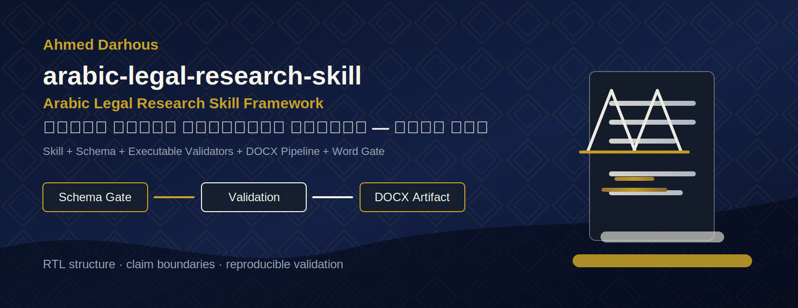
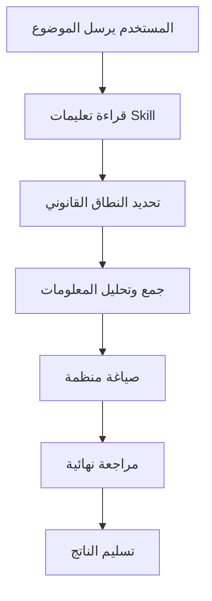
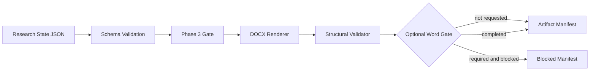

<p align="center">
  
</p>

<h1 align="center">🕌 Arabic Legal Research Skill Framework</h1>
<h3 align="center">مهارة البحث القانوني العربي — إطار عمل متكامل</h3>

<p align="center">
  <strong>أول Skill عربية متخصصة تُعلّم أدوات الذكاء الاصطناعي — ChatGPT وClaude وCodex —</strong><br>
  <strong>كيف تُعِدّ بحثًا قانونيًا عربيًا منظّمًا، موثّقًا، وقابلًا للتحقق، بدل نص عشوائي "يبدو" صحيحًا.</strong>
</p>

<p align="center">
  <a href="https://github.com/Darhous/arabic-legal-research-skill/actions/workflows/ci.yml"></a>
  =3.11" src="https://img.shields.io/badge/Python-%3E%3D3.11-1E3A8A">
  
  
  
  
  
  
  
  
  <br>
  
  
  
</p>

<p align="center">
  <a href="#-ما-فكرة-المشروع-ببساطة">الفكرة</a> ·
  <a href="#-skill-vs-framework">Skill vs Framework</a> ·
  <a href="#-لمن-هذا-المشروع">لمن هذا المشروع</a> ·
  <a href="#-ماذا-يستطيع-المشروع-أن-يفعل">القدرات</a> ·
  <a href="#-استخدامه-داخل-chatgpt--claude-بدون-تثبيت">بدون تثبيت</a> ·
  <a href="#-الاستخدام-مع-claude-code">Claude Code</a> ·
  <a href="#-الاستخدام-مع-openai-codex">Codex</a> ·
  <a href="#-التثبيت-للمطورين">للمطورين</a> ·
  <a href="#-أدلة-الاستخدام-حسب-دورك-playbooks">Playbooks</a> ·
  <a href="#-سيناريوهات-جاهزة-workflows">Workflows</a> ·
  <a href="#-الرخصة-والاستخدام-المجاني-لوجه-الله">الرخصة</a>
</p>

<p align="center">⚠️ <strong>تنبيه مهم من البداية:</strong> هذا المشروع أداة <strong>تنظيمية ومنهجية</strong> للبحث القانوني، وليس بديلًا عن استشارة محامٍ أو مستشار قانوني مختص. راجع دائمًا مخرجاته مع جهة قانونية مؤهلة قبل أي استخدام رسمي.</p>

---

## 🌟 ما فكرة المشروع ببساطة؟

لو أنت مش تقني، خُد هذا الشرح البسيط:

### ما معنى "Skill"؟

تخيّل أنك وظّفت مساعدًا ذكيًا جدًا (مثل ChatGPT أو Claude)، لكنه في كل مرة تطلب منه بحثًا قانونيًا، يتصرف بشكل مختلف: مرة يلتزم بترتيب معين، ومرة يخترع مصادر، ومرة ينسى الحواشي. **"Skill"** هي ببساطة **دفتر تعليمات ثابت ومكتوب بدقة**، تُعطيه للمساعد الذكي ليقرأه ويلتزم به **في كل مرة بنفس الطريقة**، بدل الاعتماد على الحظ أو صياغة السؤال.

### لماذا نحتاج تعليمات ثابتة للذكاء الاصطناعي؟

لأن النماذج اللغوية —مهما كانت قوية— تميل أحيانًا إلى:

- تغيير ترتيب البحث من مرة لأخرى.
- اختراع مصادر أو اقتباسات غير موجودة (Hallucination).
- الإعلان أن البحث "جاهز ونهائي" بينما ينقصه مراجعة أساسية.
- عدم الالتزام بخطة البحث المعتمدة من المشرف.

### ما المشكلة التي يحلها المشروع؟

هذا المشروع يحوّل قواعد "كتابة البحث القانوني العربي الصحيح" من نصائح عامة إلى **تعليمات مكتوبة، منظمة، ومقيَّدة بمنهجية واضحة** — تشمل ترتيب الأقسام، حماية الخطة المعتمدة، قواعد الاقتباس والحواشي، وقوائم مراجعة نهائية قبل تسليم أي شيء.

### كيف يساعد في الأبحاث القانونية العربية تحديدًا؟

لأن البحث القانوني العربي له خصوصيات: تسلسل هرمي محدد (`قسم ← باب ← فصل ← مبحث ← مطلب`)، أسلوب أكاديمي رسمي، قواعد اقتباس دقيقة للقرآن والحديث والمصادر الرسمية، وحواشي مرتبطة فعليًا بمحتوى الصفحة. المشروع يحوّل كل هذه الخصوصيات إلى قواعد صريحة يلتزم بها النموذج.

### الفرق بين استخدامه كملفات Repo واستخدامه كرابط داخل الشات؟

| الطريقة | كيف تعمل | تحتاج تثبيت؟ |
|---|---|---|
| 🔗 **رابط داخل الشات** | ترسل رابط المستودع لـ ChatGPT/Claude وتطلب منه الالتزام بتعليماته | ❌ لا، تعمل فورًا |
| 💻 **Claude Code / Codex** | تفتح المشروع محليًا على جهازك ويقرأ الأداة الملفات مباشرة | ✅ استنساخ فقط (بدون بايثون بالضرورة) |
| 🛠️ **أدوات التحقق التنفيذي (CLI)** | فحص فعلي للـ Schema وتوليد DOCX وفحصه بنيويًا | ✅ تثبيت Python (قسم المطورين) |

---

## 🧭 Skill vs Framework

**Skill** هي تعليمات نصية يقرأها النموذج ويحاول الالتزام بها. **Framework** هنا يعني: نفس
التعليمات + طبقة تنفيذية حقيقية تتحقق من النتيجة آليًا، بدل الاكتفاء بالثقة في التزام النموذج.

| الطبقة | ماذا تضيف | أين تجدها |
|---|---|---|
| 📜 تعليمات الـ Skill | القواعد المنهجية التي يقرأها النموذج | `SKILL.md`, `rules/`, `checklists/` |
| 🧬 مخطط بيانات صارم | يرفض أي بيانات لا تطابق البنية المطلوبة | `schemas/*.json` |
| ⚙️ محرك تحقق تنفيذي | يفحص فعليًا الترتيب والاستشهاد والحواشي وتعارض الأولويات | `legal-research-skill validate` |
| 📄 مولّد ومدقق DOCX | ينتج Word فعليًا ويفحص بنيته بدل افتراضها | `render-docx`, `validate-docx` |
| 🪟 بوابة Word اختيارية | فتح حقيقي داخل Word نفسه قبل `WORD_VALIDATED` | `finalize-word --require-word` |
| 🧪 اختبارات آلية | تمنع أي تراجع صامت في السلوك | `tests/` (233 اختبار) |

الشرح الكامل مع الأمثلة والمخططات: [`docs/framework-vs-skill.md`](docs/framework-vs-skill.md) ·
البنية الداخلية: [`docs/architecture.md`](docs/architecture.md) · حدود دقيقة لما يُفحص فعليًا:
[`docs/limitations.md`](docs/limitations.md) · دليل بدء سريع لكل مسار: [`docs/quickstart.md`](docs/quickstart.md).

---

## 👥 لمن هذا المشروع؟

| الفئة | كيف يفيدك المشروع |
|---|---|
| 🎓 **طالب قانون** | خطة بحث منظمة تلتزم بترتيب أكاديمي معتمد، بدل الارتجال. |
| 🔬 **باحث قانوني** | منهجية ثابتة لكل بحث: مقدمة منهجية كاملة، حواشي، ببليوغرافيا موثقة. |
| ⚖️ **محامٍ** | مذكرات ومراجعات منظمة الشكل، مع الإشارة الواضحة لكل ما يحتاج تحققًا بشريًا. |
| 👨‍💻 **مطوّر يبني Legal AI** | Schema وValidators جاهزة وCLI تنفيذي يمكن دمجه في أي نظام. |
| 🙋 **مستخدم عادي** | بحث منظم الشكل دون الحاجة لأي خبرة تقنية — فقط أرسل رابط المستودع. |
| 🤖 **مستخدم Codex / Claude / ChatGPT** | تعليمات جاهزة تحوّل أي محادثة إلى جلسة بحث قانوني منضبطة. |

---

## 🧰 ماذا يستطيع المشروع أن يفعل؟

<table>
<tr><td width="50%">

**📐 تنظيم ومنهجية**
- فرض ترتيب `قسم ← باب ← فصل ← مبحث ← مطلب`.
- حماية الخطة المعتمدة من المشرف دون تعديل غير مصرّح.
- مقدمة منهجية كاملة (مشكلة، أهمية، دراسات سابقة، أهداف...).

**📎 مصداقية المصادر**
- منع اختراع مصادر أو اقتباسات.
- تمييز أي مصدر لم يُتحقق منه بعلامة `Requires Verification` صريحة.
- قواعد دقيقة للاقتباس المباشر وغير المباشر وآيات القرآن والحديث.

</td><td width="50%">

**🧾 جودة ومراجعة**
- قوائم فحص نهائية قبل أي تسليم (منهجية، اقتباس، تنسيق، مراجعة أخيرة).
- تقليل الهلوسة عبر تعليمات صريحة ومقيّدة بدل نص حر.
- قواعد صياغة أكاديمية عربية رسمية (بلا حماس أو مبالغة أو تعميم).

**📄 مخرجات DOCX (عند توفر الأداة)**
- توليد DOCX عربي RTL كامل من بيانات بحث منظمة.
- فحص بنيوي فعلي لملف DOCX الناتج (وليس افتراضًا شكليًا).

</td></tr>
</table>

> ⚠️ **تذكير ضروري:** لا يثبت المشروع صحة الرأي القانوني، ولا يتحقق من أصالة المصادر عبر الإنترنت، ولا يقدّم مراجعة بشرية، ولا يقرر صلاحية الإيداع أو الطباعة النهائية. أي نتيجة يُعلن عنها المشروع محدودة بالضبط بما تم فحصه فعليًا — لا أكثر.

---

## 💬 استخدامه داخل ChatGPT / Claude بدون تثبيت

هذه أسهل طريقة للمبتدئين تمامًا — **لا تحتاج تثبيت أي شيء**:

1. افتح ChatGPT أو Claude في المتصفح.
2. أرسل رابط هذا المستودع: `https://github.com/Darhous/arabic-legal-research-skill`
3. اطلب من النموذج مراجعة المستودع والالتزام بتعليماته كأنه Skill مفعّلة لديه.
4. بعد ذلك، اطلب منه إعداد بحث أو مذكرة أو مراجعة قانونية على موضوعك.
5. اطلب منه الالتزام تحديدًا بالملفات: `SKILL.md`، `CODEX.md`، `checklists/final-review.md`، `rules/`، `templates/`.

### 📋 Prompt جاهز للنسخ

```text
راجع المستودع التالي والتزم بجميع تعليماته كأنها Skill مفعّلة لديك:
https://github.com/Darhous/arabic-legal-research-skill

بعد المراجعة، أريد منك إعداد بحث قانوني عربي حول: [اكتب الموضوع هنا]
التزم بمنهجية المشروع، ولا تخترع مصادر، واذكر حدود عدم اليقين، وراجع الناتج قبل التسليم.
```

نسخة مفصّلة أكثر مع تحذيرات خاصة بكل نموذج: [`prompts/chatgpt.md`](prompts/chatgpt.md) ·
[`prompts/general-use.md`](prompts/general-use.md) (تعمل مع أي نموذج آخر).

---

## 🟣 الاستخدام مع Claude Code

Claude Code هو الواجهة التطويرية لـ Claude التي تعمل من سطر الأوامر وتقرأ ملفات مشروعك مباشرة.

**الخطوات:**

1. استنسخ المستودع:

   ```bash
   git clone https://github.com/Darhous/arabic-legal-research-skill.git
   cd arabic-legal-research-skill
   ```

2. افتح Claude Code داخل مجلد المشروع:

   ```bash
   claude
   ```

3. اطلب منه قراءة `SKILL.md` و`CODEX.md` أولًا.
4. استخدم الـ Prompt الجاهز التالي:

### 📋 Prompt جاهز لـ Claude Code

```text
Read SKILL.md and CODEX.md first. Treat this repository as the active legal
research skill. Follow all rules, checklists, templates, and validation
steps before producing any legal output.
```

Claude Code يقرأ [`CLAUDE.md`](CLAUDE.md) تلقائيًا عند فتح مجلد المشروع — وهو دليل مختصر يحيله
مباشرة إلى `SKILL.md` و`CODEX.md` وقواعد صارمة لأي تعديل كود. يمكنه أيضًا تشغيل أوامر التحقق
التنفيذي (`legal-research-skill validate`, `render-docx`, ...) بنفسه للتأكد من مخرجاته — راجع
[قسم المطورين](#-التثبيت-للمطورين) والـ Prompt الكامل في [`prompts/claude.md`](prompts/claude.md).

---

## ⚫ الاستخدام مع OpenAI Codex

**الخطوات:**

1. استنسخ المستودع وافتحه في Codex:

   ```bash
   git clone https://github.com/Darhous/arabic-legal-research-skill.git
   cd arabic-legal-research-skill
   codex
   ```

2. اجعله يقرأ `README.md` و`SKILL.md` و`CODEX.md` والمجلدات الأساسية أولًا.
3. اطلب منه الالتزام بالتعليمات الموجودة قبل أي عمل.
4. استخدمه بعدها لتطوير المشروع نفسه، أو لإنتاج مستندات بحث قانوني وفق قواعد المشروع.

### 📋 Prompt جاهز لـ Codex

```text
Before doing anything, read README.md, SKILL.md, CODEX.md, rules/,
checklists/, templates/, and tests/. Then explain the project in simple
Arabic and follow the skill instructions exactly in any generated legal
research output.
```

نسخة مفصّلة مع الفرق بين استخدام Codex لإنتاج بحث واستخدامه لتطوير الكود:
[`prompts/codex.md`](prompts/codex.md).

---

## 🛠️ التثبيت للمطورين

هذا القسم لمن يريد تشغيل أدوات التحقق التنفيذي الحقيقية (CLI): توليد DOCX، الفحص البنيوي، وتشغيل الاختبارات.

```bash
git clone https://github.com/Darhous/arabic-legal-research-skill.git
cd arabic-legal-research-skill
python -m venv .venv
```

فعّل البيئة الافتراضية:

**Windows:**

```bash
.venv\Scripts\activate
```

**macOS/Linux:**

```bash
source .venv/bin/activate
```

ثم ثبّت المشروع وشغّل الاختبارات:

```bash
python -m pip install -U pip
pip install -e ".[dev]"
pytest
```

تحقق من نجاح التثبيت:

```bash
legal-research-skill list-validators
```

> المتطلبات: Python `>=3.11`. لا توجد مطالبة بنشر PyPI حاليًا. Windows وMicrosoft Word وpywin32 مطلوبة فقط عند تشغيل بوابة Word الاختيارية.

---

## 🗂️ هيكل المشروع

```text
arabic-legal-research-skill/
├── SKILL.md              دليل تشغيل الـ Skill الأساسي لـ Claude
├── CODEX.md               تعليمات الصيانة والتطوير لـ Codex
├── CLAUDE.md               دليل استخدام سريع لـ Claude / Claude Code
├── GPT.md                  دليل استخدام سريع لنماذج GPT / ChatGPT
├── docs/                    هوية الـ Framework: البنية، الحدود، البدء السريع
├── prompts/                  Prompts جاهزة لكل نموذج (ChatGPT، Claude، Codex، عام)
├── playbooks/                 أدلة استخدام حسب الدور (طالب، محامٍ، باحث، مطوّر...)
├── workflows/                   سيناريوهات جاهزة خطوة بخطوة (بحث، مذكرة، عقد...)
├── rules/                        قواعد المنهجية (الترتيب، الاقتباس، الحواشي، اللغة...)
├── checklists/                    قوائم مراجعة نهائية قبل أي تسليم
├── templates/                      متطلبات قوالب DOCX المستقبلية
├── validators/                      عقود المراجعين الداخليين (منهجية توثيقية)
├── profiles/                         ملفات تعريف مؤسسية (جامعة عامة، أكاديمية شرطة)
├── schemas/                           JSON Schema الرسمي لحالة البحث والتقارير
├── src/legal_research_skill/            حزمة Python وأداة CLI التنفيذية
├── examples/                              أمثلة بيانات وسيناريوهات تعليمية
├── tests/                                   اختبارات Unit وIntegration وAcceptance وRegression
├── reports/                                   تقارير قابلة للقراءة الآلية
└── .github/workflows/                          إعدادات CI والإصدار
```

| المجلد | وظيفته باختصار |
|---|---|
| `SKILL.md` | نقطة الدخول الرئيسية — يقرأه أي نموذج ذكاء اصطناعي أولًا. |
| `docs/` | هوية الـ Framework: الفرق عن Skill، البنية الداخلية، الحدود، البدء السريع. |
| `prompts/` | Prompts جاهزة للنسخ لكل نموذج (ChatGPT، Claude، Codex، وعام). |
| `playbooks/` | دليل عملي لكل دور: مستخدم عادي، طالب، محامٍ، باحث، مطوّر. |
| `workflows/` | خطوات كاملة لسيناريوهات شائعة (بحث، مذكرة، مراجعة عقد، DOCX...). |
| `rules/` | القواعد التفصيلية: الترتيب، الاقتباس، الحواشي، اللغة، محرك القرار. |
| `checklists/` | فحوصات نهائية إلزامية قبل اعتبار أي عمل مكتملًا. |
| `validators/` | عقود مراجعة داخلية توثيقية (منهجية، لا تُستبدل بالكود). |
| `templates/` | متطلبات قوالب DOCX المستقبلية (لا تحتوي حاليًا ملفات `.docx` جاهزة). |
| `schemas/` | التعريف الرسمي الملزم لبنية بيانات البحث والتقارير. |
| `src/legal_research_skill/` | أداة CLI الفعلية: تحقق Schema، Validators تنفيذية، توليد DOCX، فحص بنيوي. |

---

## 🧪 أمثلة استخدام عملية

جرّب هذه الطلبات (سواء داخل الشات العادي أو Claude Code أو Codex بعد تحميل التعليمات):

- 📝 **"أعدّ لي خطة بحث قانوني حول المسؤولية المدنية للطبيب في القانون المصري."**
- 🔍 **"راجع هذه المذكرة القانونية وتأكد من التزامها بترتيب الأقسام المطلوب."**
- 📄 **"حوّل هذا البحث إلى هيكل جاهز لتوليد DOCX وفق قواعد المشروع."**
- 🚨 **"افحص هذه المصادر وحدد أيها يحتاج إلى `Requires Verification`."**
- ✅ **"طبّق قائمة المراجعة النهائية `checklists/final-review.md` على هذا البحث قبل تسليمه."**
- 🧭 **"تصرف كمساعد بحث قانوني منهجي والتزم بكل قواعد `rules/` أثناء العمل معي."**

---

## 📚 أدلة الاستخدام حسب دورك (Playbooks)

كل دور له دليل عملي مباشر: لمن هذا المسار، متى تستخدمه، خطوات التنفيذ، Prompt جاهز، أخطاء يجب
تجنبها، والمخرج المتوقع.

| الدور | الدليل |
|---|---|
| 🙋 مستخدم عادي | [`playbooks/general-user.md`](playbooks/general-user.md) |
| 🎓 طالب قانون | [`playbooks/student.md`](playbooks/student.md) |
| ⚖️ محامٍ | [`playbooks/lawyer.md`](playbooks/lawyer.md) |
| 🔬 باحث قانوني | [`playbooks/researcher.md`](playbooks/researcher.md) |
| 👨‍💻 مطوّر | [`playbooks/developer.md`](playbooks/developer.md) |

---

## 🔧 سيناريوهات جاهزة (Workflows)

خطوات عملية كاملة لسيناريوهات شائعة، بدل التنظير — كل Workflow ينتهي إلزاميًا بخطوة المراجعة
النهائية.

| السيناريو | الدليل |
|---|---|
| 📝 بحث قانوني كامل | [`workflows/legal-research.md`](workflows/legal-research.md) |
| 📄 إعداد مذكرة قانونية | [`workflows/legal-memo.md`](workflows/legal-memo.md) |
| 📑 مراجعة عقد | [`workflows/contract-review.md`](workflows/contract-review.md) |
| ⚔️ تحليل قضية | [`workflows/case-analysis.md`](workflows/case-analysis.md) |
| 📦 إنتاج DOCX تنفيذي | [`workflows/docx-production.md`](workflows/docx-production.md) |
| ✅ المراجعة النهائية (إلزامية دائمًا) | [`workflows/final-review.md`](workflows/final-review.md) |

---

## 🔄 Workflow



<details>
<summary><strong>🔬 مسار التحقق التنفيذي الكامل (CLI) — انقر للتوسيع</strong></summary>



### أوامر Quick Start

```bash
legal-research-skill schema-check examples/fixtures/valid/minimal-valid.json --format json
legal-research-skill validate examples/fixtures/valid/approved-plan-locked.json --format json
legal-research-skill render-docx examples/fixtures/valid/approved-plan-locked.json --output out/draft.docx --format json
legal-research-skill validate-docx out/draft.docx --format json
legal-research-skill build-artifact examples/fixtures/valid/approved-plan-locked.json --output-dir out/artifact --format json
```

### حالات النتيجة وExit Codes

- `STRUCTURALLY_VALID`: DOCX البنيوي صالح.
- `BLOCKED`: بوابة مطلوبة لم تمر.
- `TIMEOUT`: Word worker تجاوز المهلة.
- `FAILED`: فشل تنفيذي أو بنيوي.
- `NOT_RUN`: Word gate غير مطلوب.
- `NOT_AVAILABLE`: Word أو pywin32 غير متاحين.

Exit codes: `0` نجاح · `1` فشل تحقق/artifact · `2` خطأ إدخال · `3` Word gate إلزامي ومحجوب · `4` فشل Word غير متوقع.

### بوابة Microsoft Word (اختيارية)

```bash
legal-research-skill finalize-word out/draft.docx --output out/draft-word.docx --word-timeout-seconds 60 --format json
```

Word gate اختياري تمامًا، يعمل داخل worker معزول بمهلة زمنية، ولا يقتل أي جلسة Word غير مثبتة الملكية بأي حال — يتحقق من هوية العملية عبر معايير متعددة قبل أي إنهاء.

</details>

---

## ✅ الاختبارات والجودة

```bash
python -m compileall src
ruff format --check .
ruff check .
pytest
```

الحالة الحالية: **233 اختبار ناجح، 1 متجاوَز (skip)**، بتغطية **96.12%** — حد القبول الرسمي في المشروع `95%`.

## 🔐 الأمان

- لا يستخدم `eval` أو `exec`.
- لا ينفذ ماكرو داخل DOCX ولا يسمح بعلاقات خارجية.
- لا يقتل عمليات Word العامة — تحقق ملكية متعدد المعايير قبل أي إنهاء عملية.
- لا يكتب أسرارًا في الأمثلة أو التقارير.
- GitHub Actions مثبتة بـ commit SHA وليس بوسم متحرك.

---

## 🕊️ الرخصة والاستخدام المجاني (لوجه الله)

هذا المشروع **مجاني بالكامل، لوجه الله تعالى** — صدقة علمية يُرجى صاحبها منها النفع والأجر لا المقابل المادي.

- ✅ يمكنك **استخدامه، تعديله، تطويره، وإعادة نشره** بحرية كاملة، تجاريًا أو غير تجاري.
- 🙏 يُرجى فقط **الحفاظ على نسبة الفضل** لصاحب المشروع الأصلي، أحمد درهوس (Ahmed Darhous)، عند إعادة الاستخدام أو النشر.
- 🚫 **لا يجوز** استخدام المشروع لتضليل الناس أو تقديم استشارات قانونية كاذبة باسم جهة رسمية أو مهنية.
- ⚖️ هذا المشروع **لا يغني عن المحامي المختص أو المستشار القانوني** في أي حال من الأحوال.

المشروع مرخّص رسميًا بموجب [رخصة MIT](LICENSE)، مع توضيح عربي محترم في أعلى ملف الرخصة يؤكد أنه صدقة علمية مجانية. راجع ملف [`LICENSE`](LICENSE) للنص الكامل.

---

## 🤝 المساهمة

راجع [CONTRIBUTING.md](CONTRIBUTING.md). أي تغيير يجب أن يحافظ على حدود الادعاء، حد coverage، وسلامة DOCX/Word.

## 🛡️ الإبلاغ عن مشاكل أمنية

راجع [SECURITY.md](SECURITY.md). للإبلاغ الخاص: `ahmeddarhous@gmail.com`.

---

## المؤلف

**Designed & Developed by Ahmed Darhous**

<p align="center">
  <a href="https://www.instagram.com/darhous/" target="_blank" rel="noopener noreferrer" aria-label="Instagram">Instagram</a>
  ·
  <a href="https://www.linkedin.com/in/darhous/" target="_blank" rel="noopener noreferrer" aria-label="LinkedIn">LinkedIn</a>
  ·
  <a href="https://www.facebook.com/ahmed.darhous" target="_blank" rel="noopener noreferrer" aria-label="Facebook">Facebook</a>
  ·
  <a href="https://wa.me/201030002331" target="_blank" rel="noopener noreferrer" aria-label="WhatsApp">WhatsApp</a>
  ·
  <a href="https://github.com/darhous" target="_blank" rel="noopener noreferrer" aria-label="GitHub">GitHub</a>
</p>

<p align="center">
  Designed &amp; Developed by <a href="mailto:ahmeddarhous@gmail.com">Ahmed Darhous</a>
</p>
