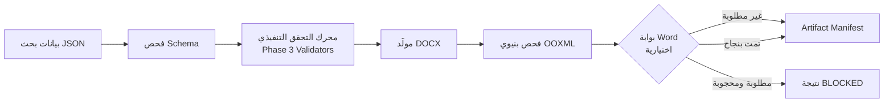

<!-- تصميم: أحمد درهوس (Ahmed Darhous) — https://github.com/darhous | Instagram: https://www.instagram.com/darhous/ | LinkedIn: https://www.linkedin.com/in/darhous/ -->

# البنية الداخلية (Architecture)

شرح مبسّط لكيفية عمل المشروع من الداخل، لمن يريد فهمًا أعمق من README.

## نظرة عامة على المسار الكامل

## الطبقات الأربع

### 1) طبقة المنهجية (نصية، تُقرأ بواسطة النموذج)

- `SKILL.md`: نقطة الدخول — يحدد المبادئ العامة ومراحل التنفيذ (Intake → مراجعة نهائية → تسليم).
- `rules/*.md`: قواعد تفصيلية (الترتيب الهرمي، الاقتباس، الحواشي، اللغة، محرك القرار، الأولويات).
- `checklists/*.md`: قوائم فحص نهائية قبل اعتبار أي عمل مكتملًا.
- `validators/*.md`: عقود مراجعين داخليين توثيقية (وصف منهجي لما يجب أن يُراجَع).
- `profiles/*/profile.md`: افتراضات مؤسسية (جامعة عامة، أكاديمية شرطة).

هذه الطبقة **نصية بالكامل** — يقرأها النموذج اللغوي، ولا "كود" يفرضها مباشرة، لكنها الأساس الذي
تُبنى عليه الطبقات التالية.

### 2) طبقة البيانات (Schema)

- `schemas/research-state.schema.json`: البنية الرسمية الملزمة لأي حالة بحث JSON.
- `schemas/validation-report.schema.json`: بنية تقرير التحقق الناتج.
- `schemas/artifact-manifest.schema.json`: بنية بيان الملفات الناتجة (Manifest).
- نسخة مطابقة من هذه الملفات مُعبّأة داخل الحزمة نفسها في
  `src/legal_research_skill/schemas/` (تُستخدم وقت التشغيل بعد التثبيت).

أي بيانات بحث لا تطابق `research-state.schema.json` تُرفض عند أول خطوة (`schema-check`) قبل أي
معالجة أخرى.

### 3) طبقة التحقق التنفيذي (Python، قابلة للاختبار)

داخل `src/legal_research_skill/`:

- `loader.py`: قراءة آمنة لملفات JSON (حدود حجم، رفض المسارات غير الآمنة).
- `models.py`: تمثيل Python منظم لحالة البحث بعد التحقق من الـ Schema.
- `validators/`: 11 مدقق تنفيذي مستقل، كل منهم يفحص جانبًا واحدًا فقط:
  `schema_integrity`, `cross_reference`, `priority_resolution`, `plan_preservation`,
  `hierarchy_compliance`, `methodology_completeness`, `citation_status`, `footnote_linkage`,
  `bibliography_completeness`, `verification_markers`, `output_claims`, `gate_readiness`.
- `pipeline.py`: ينسّق تشغيل المدققات المطلوبة ويجمع نتائجها.
- `report.py`: يحوّل نتائج التحقق إلى تقرير JSON أو نصي حتمي.
- `decisions.py`: منطق قرار العتبة (هل النتيجة تجاوزت الحد المسموح من الخطورة `--fail-on`).
- `rules.py`: سجل مركزي لمعرّفات القواعد (Rule IDs) المستخدمة في رسائل التحقق و`explain`.

### 4) طبقة توليد وفحص DOCX

داخل `src/legal_research_skill/docx/`:

- `render_model.py` + `renderer.py`: يبنيان ملف DOCX عربي RTL كامل (OPC/OOXML) من حالة بحث
  مُتحقق منها Schema-wise، بتوقيت بناء ثابت (`DEFAULT_BUILD_EPOCH`) لضمان أن تشغيل نفس المُدخل
  مرتين ينتج ملفًا مطابقًا بايتًا لبايت.
- `styles.py`, `rtl.py`, `fields.py`, `package.py`: تفاصيل التنسيق، اتجاه النص، حقول Word
  (TOC/PAGE)، وبنية حزمة OPC.
- `validation.py`: يفحص الملف الناتج بنيويًا — الأجزاء المطلوبة، العلاقات، صحة XML، خصائص RTL،
  بنية الحواشي، وحدود الحماية من ملفات ZIP الخبيثة (Zip-bomb) عبر حدود نسبة ضغط وحجم صريحة.

### 5) طبقة بوابة Word الاختيارية

داخل `src/legal_research_skill/word/`:

- `worker.py` + `worker_cli.py`: عملية معزولة (Isolated Worker Process) تُشغّل Microsoft Word عبر
  COM (`DispatchEx`)، تُحدّث الحقول وجدول المحتويات، تُعيد الترقيم، تحفظ، ثم تُغلق.
- `runner.py`: يدير هذه العملية بمهلة زمنية قابلة للتهيئة (Timeout)، ويقرأ نتيجتها المُهيكلة.
- `processes.py`: يتحقق من هوية أي عملية `WINWORD.EXE` عبر معايير حقيقية (PID + وقت الإنشاء عبر
  Win32 API) قبل إنهائها — **لا يقتل كل عمليات Word المفتوحة أبدًا**، فقط العملية التي أنشأها هو.
- `finalization.py`: يربط كل ما سبق بأمر CLI `finalize-word`.

النتيجة النهائية `WORD_VALIDATED` **لا تصدر إلا** إذا اكتمل هذا المسار فعليًا؛ إن لم يتوفر Word أو
`pywin32` أو انتهت المهلة، تكون النتيجة `NOT_AVAILABLE` أو `TIMEOUT` أو `BLOCKED` — وليس نجاحًا
افتراضيًا.

## طبقة الحزم والتوزيع

- `pyproject.toml`: تعريف الحزمة (`arabic-legal-research-skill`)، الاعتماديات المضبوطة بحد أعلى
  وأدنى، أمر CLI الوحيد `legal-research-skill`، وبيانات الحزمة (`schemas/*.json`) المُضمَّنة.
  انظر أيضًا [`docs/quickstart.md`](quickstart.md) لأوامر التثبيت الفعلية.
- `.github/workflows/ci.yml`: يبني، يفحص (`ruff`), يختبر (`pytest`)، يبني عجلة (`wheel`)، ويتحقق
  من محتواها على كل من Python 3.11 و3.12 داخل Windows.
- `.github/workflows/release.yml`: عند وسم إصدار (`v*`)، يبني وينشئ ملف SHA-256 ويرفع الناتج
  كـ CI artifact فقط — **لا ينشئ GitHub Release تلقائيًا ولا ينشر على PyPI**.

## كيف تتفاعل الطبقات مع نموذج الذكاء الاصطناعي؟

نموذج مثل Claude أو ChatGPT أو Codex يقرأ الطبقة الأولى (المنهجية) ليعرف *كيف* يكتب البحث. إن
كانت البيانات منظمة كـ JSON مطابق للـ Schema، يمكن لنفس النموذج (عبر Claude Code أو Codex أو أي
تكامل CLI) **تشغيل** الطبقات 2–5 فعليًا للتحقق من عمله بنفسه، بدل الاكتفاء بادّعاء الالتزام. هذا
هو جوهر الفرق الموضح في [`docs/framework-vs-skill.md`](framework-vs-skill.md).
